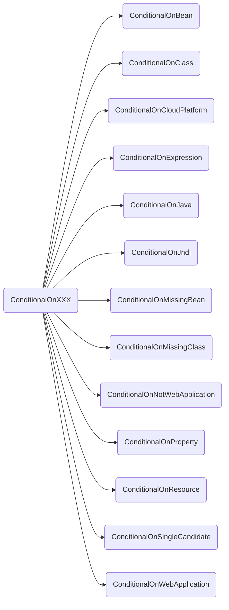
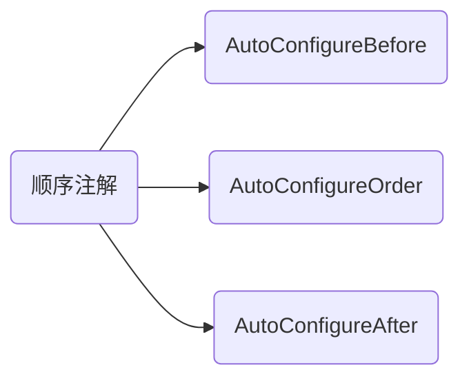

### 1. SpringBoot中的ConditionalOnXXX类型的注解

通过上面的可以看出来主要是有这些条件化加载类的注解。然后加上三个顺序的注解

通过这些注解来实现SpringBoot的自动注入和取消xml的配置。下面会选取 ***`ConditionalOnClass`*** 来进行源码分析。这些注解如何进行协同工作来实现条件化注入的。

### 2. SpringBoot源码分析之ConditionalOnClass

